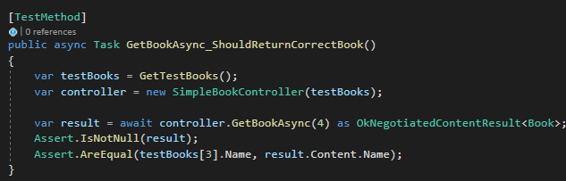
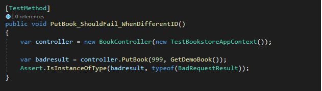
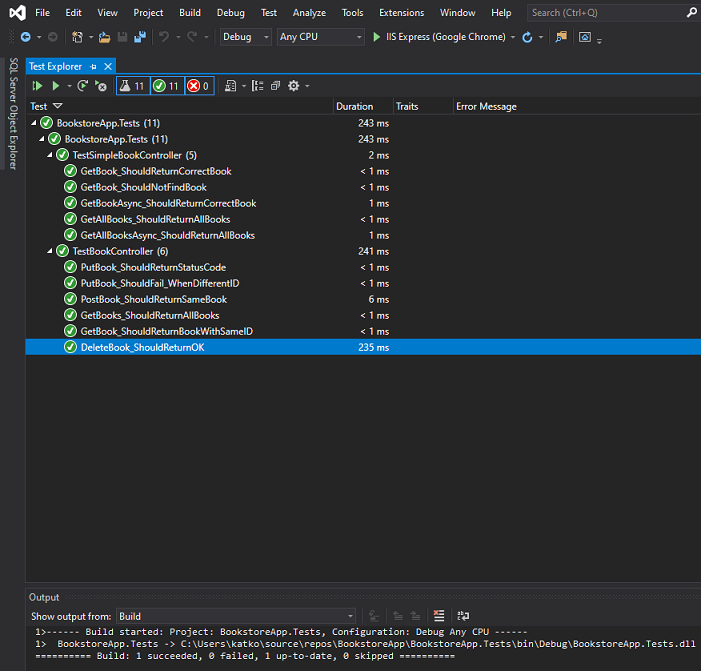

## Table of contents
* [General info](#general-info)
* [Test Examples and Text Explorer](#Test-examples-and-test-explorer)
* [Technologies](#technologies)
* [Setup](#setup)

## General info
Some simple unit tests that were created for Web API regarding books in a bookstore. Models were created and controllers were added, with data being stored as a list.  Asynchronous methods, as well as some using IHttpActionResult interface, are to be found within a controller and a test marked as ‘simple’.
A BookController, on the other hand, has been scaffolded with actions using Entity Framework. BookstoreContext class and IBookstoreAppContext interface are used here, for dependency injection purposes. Some context for the test has been set, and tests were run. Methods tested are shown in Text Explorer below, standard naming convention has been kept.

## Test Examples and Text Explorer

## Technologies

* C#
* Visual Studio
* Unit Testing Framework
* WebApi.Core Package
* EntityFramework Package

## Setup

To run this project, download the files and run in Visual Studio (version 2019 has been used). Then go to test, and choose 'run all tests'.

